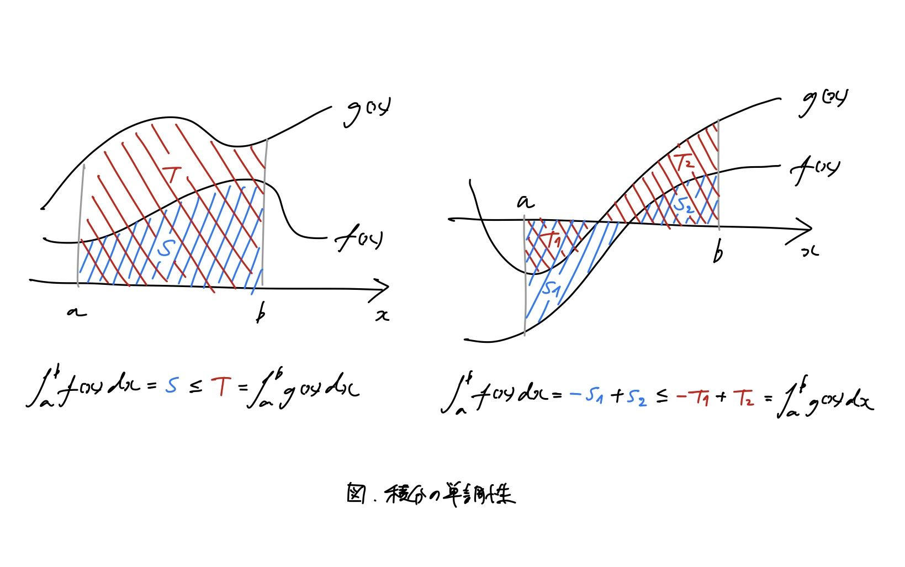

# テイラー展開

katatoshi

---

## 積分公式

**定義** $\,$ 区間 $I$ 上で定義された関数 $g(x)$ に対し，$G'(x) = g(x)$ をみたす関数 $G(x)$ を $g(x)$ の**原始関数**という．

**定理 (積分公式)** $\,$ $g(x)$ は区間 $I$ 上で連続とする．$G(x)$ を $g(x)$ の任意の原始関数とすると，
$$
G(b) - G(a) = \int_a^b g(x) dx.
$$
$\,$

$f(x)$ が区間 $I$ で微分可能で，$f'(x)$ が $I$ で連続のときは，
$$
f(b) - f(a) = \int_a^b f'(x) dx
$$
が成立する．この左辺を$\bigl[f(x)\bigr]_a^b$ともかく．

---

## 部分積分法

**定理 (部分積分法)** $\,$ 関数 $g(x), h(x)$ がある区間で微分可能で，$g'(x), h'(x)$ が連続なら，その区間内の任意の $a, b$ について
$$
\int_a^b g'(t) h(t) dt = \Bigl[g(t) h(t)\Bigr]_a^b - \int_a^b g(t) h'(t) dt.
$$
$\,$

**証明** $\,$ 関数の積の微分 $(g(x) h(x))' = g'(x) h(x) + g(x) h'(x)$ の両辺を $a$ から $b$ まで積分する．$g'(x) h(x)$ も $g(x) h'(x)$ も連続だから，この両辺の各項は積分できるので，積分公式より，
<!-- $$
% \Bigl[g(t) h(t) \Bigr]_a^b = \int_a^b (g(t) h(t))' dt = \int_a^b g'(t) h(t) dt + \int_a^b g(t) h'(t) dt.
% \int_a^b g'(t) h(t) dt + \int_a^b g(t) h'(t) dt = \int_a^b (g(t) h(t))' dt = \Bigl[g(t) h(t) \Bigr]_a^b.
\int_a^b \left(g'(t) h(t) + g(t) h'(t)\right) dt = \int_a^b g'(t) h(t) dt + \int_a^b g(t) h'(t) dt = \int_a^b (g(t) h(t))' dt = \Bigl[g(t) h(t) \Bigr]_a^b.
$$ -->
$$
\begin{align*}
\int_a^b g'(t) h(t) dt + \int_a^b g(t) h'(t) dt
& = \int_a^b \left(g'(t) h(t) + g(t) h'(t)\right) dt \quad \text{($\because$ 積分の線形性)} \\
& = \int_a^b (g(t) h(t))' dt \\
& = \Bigl[g(t) h(t) \Bigr]_a^b.
\end{align*}
$$
(証明終)

---

## テイラー公式

**定理 (積分型の剰余項のテイラー公式)** $\,$ $[x_0, x]$ で $f^{(n-1)}$ が連続であって，$[x_0, x]$ で $f^{(n)}$ が存在して連続なら，
<!-- $$
\begin{align*}
& f(x) = f(x_0) + \frac{f'(x_0)}{1!} (x - x_0) + \frac{f''(x_0)}{2!} (x - x_0)^2 + \cdots + \frac{f^{(n - 1)}(x_0)}{(n - 1)!} (x - x_0)^{n - 1} + R_n(x), \\
& R_n(x) = \int_{x_0}^x \frac{(x - t)^{n - 1}}{(n - 1)!} f^{(n)}(t) dt.
\end{align*}
$$ -->
$$
\begin{align*}
f(x) & = f(x_0) + \frac{f'(x_0)}{1!} (x - x_0) + \frac{f''(x_0)}{2!} (x - x_0)^2 + \cdots + \frac{f^{(n - 1)}(x_0)}{(n - 1)!} (x - x_0)^{n - 1} + R_n(x) \\
& = \sum_{k = 0}^{n - 1} \frac{f^{(k)}(x_0)}{k!} (x - x_0)^{k} + R_n(x)
\end{align*}
$$
$$
R_n(x) = \int_{x_0}^x \frac{(x - t)^{n - 1}}{(n - 1)!} f^{(n)}(t) dt.
$$
$\,$
$R_n(x)$ をテイラー公式の**剰余項**という．この $R_n(x)$ の表わし方はいろいろあって，上の定理の $R_n(x)$ は**積分型の剰余項**という ($f^{(n)}(x)$ の連続性がなくてもテイラー公式は成り立つが，連続性を仮定すると，この積分型の剰余項のテイラー公式が成り立つ)．

---

**証明** $\,$ $\int_{x_0}^x f'(t) dt = \bigl[f(t)\bigr]_{x_0}^x = f(x) - f(x_0)$ より
$$
\begin{align*}
f(x) = f(x_0) + \int_{x_0}^x f'(t) dt.
\end{align*}
$$
$g(t) = x - t$ と $h(t) = -f'(t)$ は $[x_0, x]$ で微分可能で，$g'(t) = -1$ と $h'(t) = -f''(t)$ は $[x_0, x]$ で連続であるから，部分積分法より
$$
\begin{align*}
\int_{x_0}^x f'(t) dt
& = \int_{x_0}^x g'(t) h(t) dt \\
& = \Bigl[g(t) h(t)\Bigr]_{x_0}^x - \int_{x_0}^x g(t) h'(t) dt \\
& = - \Bigl[(x - t) f'(t)\Bigr]_{x_0}^x + \int_{x_0}^x (x - t) f''(t) dt
\end{align*}
$$
であるから

---

$$
\begin{align*}
f(x)
& = f(x_0) - \Bigl[(x - t) f'(t)\Bigr]_{x_0}^x + \int_{x_0}^x (x - t) f''(t) dt \\
& = f(x_0) - \left((x - x) f'(x) - (x - x_0) f'(x_0)\right) + \int_{x_0}^x (x - t) f''(t) dt \\
& = f(x_0) + f'(x_0) (x - x_0) + \int_{x_0}^x (x - t) f''(t) dt.
\end{align*}
$$
$g(t) = (x - t)^2/2$ と $h(t) = -f''(t)$ は $[x_0, x]$ で微分可能で，$g'(t) = -(x - t)$ と $h'(t) = -f'''(t)$ は $[x_0, x]$ で連続であるから，部分積分法より
$$
\begin{align*}
\int_{x_0}^x (x - t) f''(t) dt
& = \int_{x_0}^x g'(t) h(t) dt \\
& = \Bigl[g(t) h(t)\Bigr]_{x_0}^x - \int_{x_0}^x g(t) h'(t) dt \\
& = - \left[\frac{(x - t)^2}{2} f''(t)\right]_{x_0}^x + \int_{x_0}^x \frac{(x - t)^2}{2} f'''(t) dt
\end{align*}
$$
であるから

---

$$
\begin{align*}
f(x)
& = f(x_0) + f'(x_0) (x - x_0) - \left[\frac{(x - t)^2}{2} f''(t)\right]_{x_0}^x + \int_{x_0}^x \frac{(x - t)^2}{2} f'''(t) dt \\
& = f(x_0) + f'(x_0) (x - x_0) + \frac{f''(x_0)}{2} (x - x_0)^2 + \int_{x_0}^x \frac{(x - t)^2}{2} f'''(t) dt.
\end{align*}
$$
$g(t) = (x - t)^3/3!$ と $h(t) = -f'''(t)$ は $[x_0, x]$ で微分可能で，$g'(t) = -(x - t)^2/2$ と $h'(t) = -f''''(t)$ は $[x_0, x]$ で連続であるから，部分積分法より
$$
\begin{align*}
\int_{x_0}^x \frac{(x - t)^2}{2} f'''(t) dt
& = \int_{x_0}^x g'(t) h(t) dt \\
& = \Bigl[g(t) h(t)\Bigr]_{x_0}^x - \int_{x_0}^x g(t) h'(t) dt \\
& = - \left[\frac{(x - t)^3}{3!} f'''(t)\right]_{x_0}^x + \int_{x_0}^x \frac{(x - t)^3}{3!} f''''(t) dt
\end{align*}
$$
であるから

---

$$
\begin{align*}
f(x)
& = f(x_0) + f'(x_0) (x - x_0) + \frac{f''(x_0)}{2} (x - x_0)^2 - \left[\frac{(x - t)^3}{3!} f'''(t)\right]_{x_0}^x + \int_{x_0}^x \frac{(x - t)^3}{3!} f''''(t) dt \\
& = f(x_0) + f'(x_0) (x - x_0) + \frac{f''(x_0)}{2} (x - x_0)^2 + \frac{f'''(x_0)}{3!} (x - x_0)^3 + \int_{x_0}^x \frac{(x - t)^3}{3!} f''''(t) dt.
\end{align*}
$$

同じことを $g(t) = (x - t)^{(n - 1)} / (n - 1)!$，$h(t) = -f^{(n - 1)}(t)$ まで繰り返すことができるので，結局，

$$
\begin{align*}
f(x) = f(x_0) & + f'(x_0) (x - x_0) + \frac{f''(x_0)}{2} (x - x_0)^2 + \frac{f'''(x_0)}{3!} (x - x_0)^3 \\
& + \cdots + \frac{f^{(n - 1)}(x_0)}{(n - 1)!} (x - x_0)^{n - 1} + \int_{x_0}^x \frac{(x - t)^{n - 1}}{(n - 1)!} f^{(n)}(t) dt.
\end{align*}
$$
(証明終)

---

## 指数関数のテイラー公式

指数関数 $f(x) = e^x$ は $\mathbf{R}$ 上で微分可能で，$f'(x) = e^x$ である．つまり，$f(x)$ は何回でも微分可能であり，$f^{(n)}(x) = e^x$ である．したがって，$f(x) = e^x$ にテイラー公式を $x_0 = 0$ で適用すると，$f^{(n)}(0) = e^0 = 1$ より，任意の $n$ について
$$
\begin{align*}
e^x & = f(x) \\
& = f(0) + \frac{f'(0)}{1!} x + \frac{f''(0)}{2!} x^2 + \cdots + \frac{f^{(n - 1)}(0)}{(n - 1)!} x^{n - 1} + R_n(x) \\
& = 1 + \frac{1}{1!} x + \frac{1}{2!} x^2 + \cdots + \frac{1}{(n - 1)!} x^{n - 1} + R_n(x) \\
& = \sum_{k = 0}^{n - 1} \frac{x^k}{k!} + R_n(x),
\end{align*}
$$
$$
R_n(x) = \int_{0}^x \frac{(x - t)^{n - 1}}{(n - 1)!} f^{(n)}(t) dt = \int_{0}^x \frac{(x - t)^{n - 1}}{(n - 1)!} e^t dt.
$$
が成り立つ．

---

## 三角関数のテイラー公式

三角関数 $f(x) = \cos x$ と $g(x) = \sin x$ は $\mathbf{R}$ 上で微分可能で，$f'(x) = -\sin x = -g(x)$，$g'(x) = \cos x = f(x)$ である．つまり，$f(x)$ と $g(x)$ は何回でも微分可能であり，
$$
\begin{align*}
f^{(0)}(x) & = f(x), & g^{(0)}(x) & = g(x), \\
f^{(1)}(x) & = -g(x), & g^{(1)}(x) & = f(x), \\
f^{(2)}(x) & = -f(x), & g^{(2)}(x) & = -g(x), \\
f^{(3)}(x) & = g(x), & g^{(3)}(x) & = -f(x), \\
f^{(4)}(x) & = f(x), & g^{(4)}(x) & = g(x), \\
f^{(5)}(x) & = -g(x), & g^{(5)}(x) & = f(x), \\
& \vdots & & \vdots
\end{align*}
$$
である．したがって，$f(x) = \cos x$ と $g(x) = \sin x$ にテイラー公式を $x_0 = 0$ で適用すると，$f(0) = \cos 0 = 1$，$g(0) = \sin 0 = 0$ より，

---

$$
\begin{align*}
f^{(0)}(0) & = f(0)= 1, & g^{(0)}(0) & = g(0) = 0, \\
f^{(1)}(0) & = -g(0) = 0, & g^{(1)}(0) & = f(0) = 1, \\
f^{(2)}(0) & = -f(0) = -1, & g^{(2)}(0) & = -g(0) = 0, \\
f^{(3)}(0) & = g(0) = 0, & g^{(3)}(0) & = -f(0) = -1, \\
f^{(4)}(0) & = f(0) = 1, & g^{(4)}(0) & = g(0) = 0, \\
f^{(5)}(0) & = -g(0) = 0, & g^{(5)}(0) & = f(0) = 1, \\
& \vdots & & \vdots \\
f^{(2n)}(0) & = (-1)^n, & g^{(2n)}(0) & = 0, \\
f^{(2n + 1)}(0) & = 0, & g^{(2n + 1)}(0) & = (-1)^n,
\end{align*}
$$
であるから，任意の $n$ について

---

$$
\begin{align*}
\cos x & = f(x) \\
& = f^{(0)}(0) + \frac{f^{(1)}(0)}{1!} x + \frac{f^{(2)}(0)}{2!} x^2 + \frac{f^{(3)}(0)}{3!} x^3 + \cdots + \frac{f^{(2(n - 1))}(0)}{(2(n - 1))!} x^{2(n - 1)} + \frac{f^{(2n - 1)}(0)}{(2n - 1)!} x^{2n - 1} + R_{2n}(x) \\
& = 1 + \frac{0}{1!} x - \frac{1}{2!} x^2 + \frac{0}{3!} x^3 + \cdots + \frac{(-1)^n}{(2(n - 1))!} x^{2(n - 1)} + \frac{0}{(2n - 1)!} x^{2n - 1} + R_{2n}(x) \\
& = 1 - \frac{1}{2!} x^2 + \frac{1}{4!} x^4 - \frac{1}{6!} x^6 + \cdots + \frac{(-1)^n}{(2(n - 1))!} x^{2(n - 1)} + R_{2n}(x) \\
& = \sum_{k = 0}^{n - 1} (-1)^{k} \frac{x^{2k}}{(2k)!} + R_{2n}(x),
\end{align*}
$$
$$
\begin{align*}
R_{2n}(x) & = \int_{0}^x \frac{(x - t)^{2n - 1}}{(2n - 1)!} f^{(2n)}(t) dt \\
& = \int_{0}^x \frac{(x - t)^{2n - 1}}{(2n - 1)!} (-1)^n f(t) dt \\
& = \int_{0}^x \frac{(x - t)^{2n - 1}}{(2n - 1)!} (-1)^n \cos t \, dt,
\end{align*}
$$

---

$$
\begin{align*}
\sin x & = g(x) \\
& = g^{(0)}(0) + \frac{g^{(1)}(0)}{1!} x + \frac{g^{(2)}(0)}{2!} x^2 + \frac{g^{(3)}(0)}{3!} x^3 + \cdots + \frac{g^{(2n + 1)}(0)}{(2n + 1)!} x^{2n + 1} + \frac{g^{(2(n + 1))}(0)}{(2(n + 1))!} x^{2(n + 1)} + R_{2n + 3}(x) \\
& = 0 + \frac{1}{1!} x + \frac{0}{2!} x^2 - \frac{1}{3!} x^3 + \cdots + \frac{(-1)^n}{(2n + 1)!} x^{2n + 1} + \frac{0}{(2(n + 1))!} x^{2(n + 1)} + R_{2n + 3}(x) \\
& = \frac{1}{1!} x - \frac{1}{3!} x^3 + \frac{1}{5!} x^5 - \frac{1}{7!} x^7 + \cdots + \frac{(-1)^n}{(2n + 1)!} x^{2n + 1} + R_{2n + 3}(x) \\
& = \sum_{k = 0}^{n} (-1)^{k} \frac{x^{2k + 1}}{(2k + 1)!} + R_{2n + 3}(x),
\end{align*}
$$
$$
\begin{align*}
R_{2n + 3}(x) & = \int_{0}^x \frac{(x - t)^{2(n + 1)}}{(2(n + 1))!} g^{(2n + 3)}(t) dt \\
& = \int_{0}^x \frac{(x - t)^{2(n + 1)}}{(2(n + 1))!} (-1)^{n + 1} g(t) dt \\
& = \int_{0}^x \frac{(x - t)^{2(n + 1)}}{(2(n + 1))!} (-1)^{n + 1} \sin t \, dt.
\end{align*}
$$

---

## テイラー展開

**定義** $\,$ $x_0$ の近傍で定義された何回でも微分可能な関数 $f(x)$ は，$|x - x_0| < \rho$ $\,(\rho > 0)$ で収束する級数 $\displaystyle \sum_{n = 0}^\infty a_n (x - x_0)^n$ があって，$x_0$ の適当な近傍において恒等的に，
$$
f(x) = \sum_{n = 0}^\infty a_n (x - x_0)^n
$$
が成立するとする．このとき，この級数を $f(x)$ の**テイラー展開**という (このとき，$f(x)$ は $x_0$ において**解析的**であるという)．
$\,$
なお，$x_0$ の近傍とは $U_\varepsilon(x_0) = (x_0 - \varepsilon, x_0 + \varepsilon)$ $\,(\varepsilon > 0)$ という開区間のことである．

<!-- **定義** $\,$ $f(x)$ を $(x_0 - R_1, x_0 + R_2)$ $\, (0 < R_1, R_2 \leq +\infty)$ で定義された，何回でも微分可能な関数とする．$x_0 - \rho < x < x_0 + \rho$ $\, (\rho > 0)$ で収束する級数 $\displaystyle \sum_{n = 0}^\infty a_n (x - x_0)^n$ があって，$x_0 - \varepsilon < x < x_0 + \varepsilon$ $\, (\varepsilon > 0)$ をみたす $x$ において恒等的に,
$$
f(x) = \sum_{n = 0}^\infty a_n (x - x_0)^n
$$
が成立するとする．この級数を $f(x)$ の**テイラー展開**という (このとき，$f(x)$ は $x_0$ において**解析的**であるという)． -->

---

## テイラー公式とテイラー展開

テイラー公式
$$
f(x) = \sum_{k = 0}^{n - 1} \frac{f^{(k)}(x_0)}{k!} (x - x_0)^{k} + R_n(x)
$$
において，右辺の第1項は $f(x)$ のテイラー展開の部分和だから，$n \to \infty$ のとき，この部分和が $x_0$ の近傍において $f(x)$ に収束することは，とりもなおさず $x_0$ の近傍の各点 $x$ で
$$
\lim_{n \to \infty} R_n(x) = 0
$$
が成立することである．
<!-- $$
\begin{align*}
f(x) & = f(x_0) + \frac{f'(x_0)}{1!} (x - x_0) + \frac{f''(x_0)}{2!} (x - x_0)^2 + \cdots + \frac{f^{(n - 1)}(x_0)}{(n - 1)!} (x - x_0)^{n - 1} + R_n(x) \\
& = \sum_{k = 0}^{n - 1} \frac{f^{(k)}(x_0)}{k!} (x - x_0)^{k} + R_n(x)
\end{align*}
$$
において，最右辺の第1項は $f(x)$ のテイラー展開の部分和だから，$n \to \infty$ のときこの部分和が $f(x)$ に収束することは，
$$
\lim_{n \to \infty} R_n(x) = \lim_{n \to \infty} \int_{x_0}^x \frac{(x - t)^{n - 1}}{(n - 1)!} f^{(n)}(t) dt = 0
$$
が成立することと同値である． -->

---

## 指数関数のテイラー展開

$x_0 = 0$ における指数関数のテイラー公式
$$
e^x = \sum_{k = 0}^{n - 1} \frac{x^k}{k!} + R_n(x), \quad R_n(x) = \int_{0}^x \frac{(x - t)^{n - 1}}{(n - 1)!} e^t dt
$$
の剰余項 $R_n(x)$ が，任意の $x$ で $0$ に収束するか確認する．$x > 0$ なら，積分の三角不等式より，
$$
\begin{align*}
|R_n(x)| & = \left|\int_{0}^x \frac{(x - t)^{n - 1}}{(n - 1)!} e^t dt\right| \\
& \leq \int_{0}^x \left|\frac{(x - t)^{n - 1}}{(n - 1)!} e^t \right| dt \quad \text{($\because$ 三角不等式)} \\
& = \int_{0}^x \frac{(x - t)^{n - 1}}{(n - 1)!} |e^t| dt \quad \text{($\because x - t \geq 0$ より $(x - t)^{n - 1} \geq 0$)}
\end{align*}
$$
が成り立つ．$x > 0$ なら $e^t \leq e^x$ $\,(0 \leq t \leq x)$ であるから，積分の単調性より，

---

$$
\begin{align*}
\int_{0}^x \frac{(x - t)^{n - 1}}{(n - 1)!} |e^t| dt
& \leq \int_{0}^x \frac{(x - t)^{n - 1}}{(n - 1)!} |e^x| dt \\
& = \frac{|e^x|}{(n - 1)!} \int_{0}^x (x - t)^{n - 1} dt \\
& = \frac{|e^x|}{(n - 1)!} \Bigl[-\frac{(x - t)^n}{n}\Bigr]_0^x \\
& = |e^x| \frac{x^n}{n!}
\end{align*}
$$
が成り立つ．$|e^x|$ は $n$ に無関係で，$\displaystyle \frac{x^n}{n!}$ は $n \to \infty$ のとき $0$ に収束するので，
$$
0 \leq |R_n(x)| \leq |e^x| \frac{x^n}{n!} \to 0 \quad (n \to \infty)
$$
したがって，$\displaystyle \lim_{n \to \infty} |R_n(x)| = 0$ であるから $\displaystyle \lim_{n \to \infty} R_n(x) = 0$．

---

$x < 0$ なら，積分の三角不等式より，
$$
\begin{align*}
|R_n(x)| & = \left|\int_{0}^x \frac{(x - t)^{n - 1}}{(n - 1)!} e^t dt\right| \\
& = \left|-\int_{x}^0 \frac{(x - t)^{n - 1}}{(n - 1)!} e^t dt\right| \quad \text{($\because$ $a \geq b$ のときの積分 $\displaystyle \int_a^b f(x) dx$)} \\
& = \left|\int_{x}^0 \frac{(x - t)^{n - 1}}{(n - 1)!} e^t dt\right| \\
& \leq \int_{x}^0 \left|\frac{(x - t)^{n - 1}}{(n - 1)!} e^t \right| dt \quad \text{($\because$ 三角不等式)} \\
& = \int_{x}^0 \frac{|(-1)^{n - 1} (t - x)^{n - 1}|}{(n - 1)!} |e^t| dt \\
& = \int_{x}^0 \frac{(t - x)^{n - 1}}{(n - 1)!} |e^t| dt \quad \text{($\because t - x \geq 0$ より $(t - x)^{n - 1} \geq 0$)}
\end{align*}
$$
が成り立つ．$x < 0$ なら $e^t \leq e^0 = 1$ $\,(x \leq t \leq 0)$ であるから，積分の単調性より，

---

$$
\begin{align*}
\int_{x}^0 \frac{(t - x)^{n - 1}}{(n - 1)!} |e^t| dt
& \leq \int_{x}^0 \frac{(t - x)^{n - 1}}{(n - 1)!} dt \\
& = \frac{1}{(n - 1)!} \int_{x}^0 (t - x)^{n - 1} dt \\
& = \frac{1}{(n - 1)!} \Bigl[\frac{(t - x)^n}{n}\Bigr]_x^0 \\
& = \frac{x^n}{n!}
\end{align*}
$$
が成り立つ．したがって，$x > 0$ のときと同様にして，$\displaystyle \lim_{n \to \infty} R_n(x) = 0$．

よって，剰余項 $R_n(x)$ は任意の $x$ で $0$ に収束するので，
$$
e^x = \sum_{k = 0}^\infty \frac{x^k}{k!}
$$
が任意の $x$ で成り立つ．

<!-- よって，任意の $x$ についてテイラー展開
$$
% e^x = \lim_{n \to \infty} \left(\sum_{k = 0}^{n - 1} \frac{x^k}{k!} + R_n(x)\right) = \sum_{k = 0}^\infty \frac{x^k}{k!} + \lim_{n \to \infty} R_n(x) = \sum_{k = 0}^\infty \frac{x^k}{k!}
e^x = \sum_{k = 0}^\infty \frac{x^k}{k!}
$$
が成り立つ． -->

---

## 三角関数のテイラー展開

<!-- 
---

## 積分の三角不等式

**命題 (三角不等式)** $\,$ $f(x)$ が $I = [a, b]$ で連続なら
$$
\left|\int_a^b f(x) dx\right| \leq \int_a^b |f(x)| dx
$$
が成り立つ．
$\,$
実数の三角不等式
$$
\left|\sum_{k = 1}^n a_k\right| \leq \sum_{k = 1}^n |a_k|
$$
と同様の不等式が，積分についても成り立つということ (積分 ($\int$) が和 ($+$)の拡張なら，和で成り立っていた三角不等式が積分でも成り立つことが期待されるが，実際に成り立つということ)． -->
<!-- 
---

## 積分の性質

**命題** $\,$ $f(x)$，$g(x)$ が $I = [a, b]$ で連続なら
1. (**単調性**) $\,$ $f(x) \leq g(x)$ なら $\displaystyle \int_a^b f(x) dx \leq \int_a^b g(x) dx$.
1. (**三角不等式**) $\,$ $\displaystyle \left|\int_a^b f(x) dx\right| \leq \int_a^b |f(x)| dx$.
$\,$

単調性は，$g(x)$ のグラフが $f(x)$ のグラフより上にあるなら，$g(x)$ のグラフと $x$ 軸の間の面積は，$f(x)$ のグラフと $x$ 軸の間の面積より大きいということ．

積分の三角等式は，実数の三角不等式
$$
\left|\sum_{k = 1}^n a_k\right| \leq \sum_{k = 1}^n |a_k|
$$
と同様の不等式が，積分についても成り立つということ (積分 ($\int$) が和 ($+$)の拡張なら，和で成り立っていた三角不等式が積分でも成り立つことが期待されるが，実際に成り立つということ)． -->

---

## 補足: 積分の線形性

**命題 (積分の線形性)** $\,$ $f(x)$, $g(x)$ が $I = [a, b]$ で連続で連続なら，
$$
\begin{align*}
\int_a^b \left\{f(x) + g(x) \right\} dx & = \int_a^b f(x) dx + \int_a^b g(x) dx, \\
\int_a^b \lambda f(x) dx & = \lambda \int_a^b f(x) dx \quad \text{($\lambda$: 定数)}.
\end{align*}
$$

---

## 補足: 積分の単調性

**命題 (積分の単調性)** $\,$ $f(x)$，$g(x)$ は $I = [a, b]$ で連続とする．$f(x) \leq g(x)$ なら
$$
\int_a^b f(x) dx \leq \int_a^b g(x) dx.
$$
$\,$
$g(x)$ のグラフが $f(x)$ のグラフより上にあるなら，$g(x)$ のグラフと $x$ 軸の間の面積は，$f(x)$ のグラフと $x$ 軸の間の面積より大きいということ．

---

---

## 補足: 積分の三角不等式

**命題 (積分の三角不等式)** $\,$ $f(x)$ が $I = [a, b]$ で連続なら
$$
\left|\int_a^b f(x) dx\right| \leq \int_a^b |f(x)| dx.
$$
$\,$

**証明** $\,$ $f(x)$ が連続なら $|f(x)|$ もそうで，$-|f(x)| \leq f(x) \leq |f(x)|$ だから，単調性より，$\displaystyle -\int_a^b |f(x)| dx \leq \int_a^b f(x) dx \leq \int_a^b |f(x)| dx$．したがって，$\displaystyle \left|\int_a^b f(x) dx\right| \leq \int_a^b |f(x)| dx$． (証明終)
$\,$

積分の三角等式は，実数の三角不等式
$$
\left|\sum_{k = 1}^n a_k\right| \leq \sum_{k = 1}^n |a_k|
$$
と同様の不等式が，積分についても成り立つということ (積分 ($\int$) が和 ($+$)の拡張なら，和で成り立っていた三角不等式が積分でも成り立つことが期待されるが，実際に成り立つということ)．

---

## 補足: $a \geq b$ のときの $\int_a^b f(x) dx$

$a \geq b$ のとき，
$$
\int_a^a f(x) dx = 0, \quad \int_a^b f(x) dx = -\int_b^a f(x) dx
$$
とおく．

---

## 参考文献

- 笠原 晧司『微分積分学』サイエンス社，1974