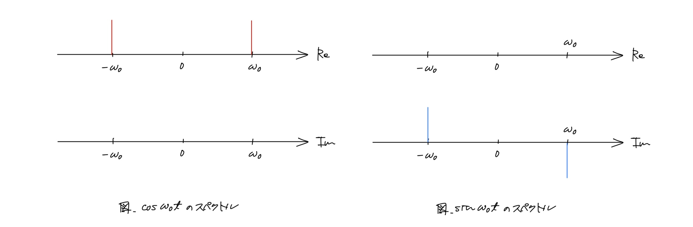
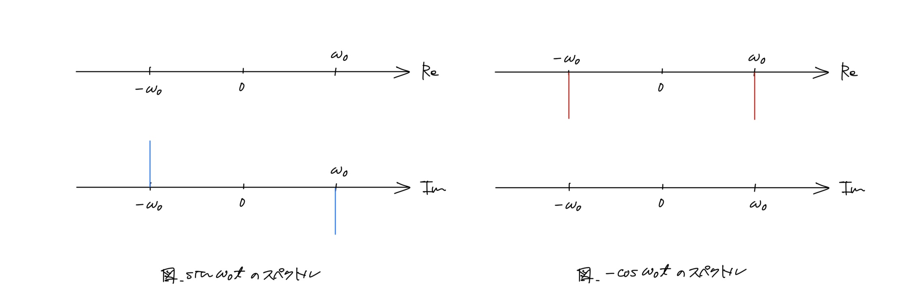

$$
\DeclareMathOperator{\Arccos}{Arccos}
\DeclareMathOperator{\Arcsin}{Arcsin}
\DeclareMathOperator{\Arctan}{Arctan}
\let\Re\relax
\DeclareMathOperator{\Re}{Re}
\let\Im\relax
\DeclareMathOperator{\Im}{Im}
\DeclareMathOperator{\sgn}{sgn}
$$

# 直交波とヒルベルト変換

katatoshi

---

## 要約

- サイン波 ($\cos \omega_0 t$, $\sin \omega_0 t$) の位相を $\pi / 2$ 遅らせた波を直交波と呼ぶ
- サイン波とは限らない周期的な波をフーリエ級数展開で表すと各項にサイン波が現れるので，各項のサイン波をその直交波に置き換えたものを，その波の直交波と呼べばよい
- 周期的とは限らない波をフーリエ変換のフーリエ逆変換で表すと被積分関数にサイン波が現れるので，被積分関数のサイン波を直交波に置き換えたものを，その波の直交波と呼べばよい
- 時間領域でサイン波の位相を $\pi / 2$ 遅らせることは，周波数領域ではサイン波のスペクトル (フーリエ変換)に $-j \sgn(\omega)$ をかけることに対応する
- フーリエ級数展開，フーリエ変換，フーリエ逆変換の線形性から，サイン波以外の波からその直交波を作ることは，周波数領域ではその波のスペクトルに $-j \sgn(\omega)$ をかけることに対応する
- スペクトルと $-j \sgn(\omega)$ の積をフーリエ逆変換すると，ヒルベルト変換が現れる
- ある波とその直交波は確かに直交している，すなわち内積が $0$ である

---

## 直交波

- サイン波 ($\cos \omega_0 t$, $\sin \omega_0 t$) の位相を $\pi / 2$ 遅らせた波 (信号，関数) を**直交波**と呼ぶ
  - $\cos \omega_0 t$ の直交波は $\displaystyle \sin \omega_0 t = \cos \left(\omega_0 t - \frac{\pi}{2}\right)$ である
  - $\sin \omega_0 t$ の直交波は $\displaystyle -\cos \omega_0 t = \sin\left(\omega_0 t - \frac{\pi}{2}\right)$ である
- サイン波とは限らない周期的な波については，そのフーリエ級数展開の各項のサイン波の位相を $\pi / 2$ 遅らせた波を，その波の直交波と呼ぶ
  - $\displaystyle \sum_{n = -\infty}^\infty c_n e^{j 2 \pi \frac{n}{T} t}$ の直交波は $\displaystyle \sum_{n = -\infty}^\infty c_n e^{j\left(2 \pi \frac{n}{T} t - \frac{\pi}{2}\right)}$ である ($c_n$ は複素フーリエ係数，$T$ は周期)
- 周期的とは限らない波については，そのスペクトル (フーリエ変換) のフーリエ逆変換の被積分関数のサイン波の位相を $\pi / 2$ 遅らせた波を，その波の直交波と呼ぶ
  - $\displaystyle \frac{1}{2 \pi}\int_{-\infty}^\infty X(\omega) e^{j \omega t} d\omega$ の直交波は $\displaystyle \frac{1}{2 \pi}\int_{-\infty}^\infty X(\omega) e^{j \left(\omega t - \frac{\pi}{2}\right)} d\omega$ である ($X(\omega)$ はスペクトル)

---

## 直交波の周波数領域での表現

サイン波のスペクトル，すなわちフーリエ変換は
$$
\begin{gather*}
\mathcal{F}[\cos \omega_0 t](\omega) = \pi (\delta(\omega + \omega_0) + \delta(\omega - \omega_0)), \\
\mathcal{F}[\sin \omega_0 t](\omega) = j \pi (\delta(\omega + \omega_0) - \delta(\omega - \omega_0))
\end{gather*}
$$
である．ただし，$\mathcal{F}$ はフーリエ変換，$\delta(\omega)$ はディラックのデルタ関数である (付録を参照)．なお，以下では $\omega_0 > 0$ とする．

---

サイン波のスペクトルを $\omega$ の値で場合分けすると次のようになる．
$$
\mathcal{F}[\cos \omega_0 t](\omega) = \begin{cases}
\pi \delta(\omega - \omega_0) & \text{($\omega > 0$)} \\
0 & \text{($\omega = 0$)} \\
\pi \delta(\omega + \omega_0) & \text{($\omega < 0$)},
\end{cases}
\quad
\mathcal{F}[\sin \omega_0 t](\omega) = \begin{cases}
-j \pi \delta(\omega - \omega_0) & \text{($\omega > 0$)} \\
0 & \text{($\omega = 0$)} \\
j \pi \delta(\omega + \omega_0) & \text{($\omega < 0$)}.
\end{cases}
$$

---

これらを見比べると，$\sin \omega_0 t$ のスペクトルは $\cos \omega_0 t$ のスペクトルに

1. $\omega > 0$ のときは $-j$ をかけたもの
1. $\omega = 0$ のときは $0$ をかけたもの
1. $\omega < 0$ のときは $j$ をかけたもの

であることがわかる．したがって，符号関数
$$
\sgn(\omega) =
\begin{cases}
1 & \text{($\omega > 0$)} \\
0 & \text{($\omega = 0$)} \\
-1 & \text{($\omega < 0$)}
\end{cases}
$$
を使えば，
$$
-j \sgn(\omega) \mathcal{F}[\cos \omega_0 t](\omega) = \mathcal{F}[\sin \omega_0 t](\omega)
$$
が成り立つことになる．つまり，$\cos \omega_0 t$ については，そのスペクトルに $-j \sgn(\omega)$ をかけることで，その直交波のスペクトルが得られる．

---

次に，$\sin \omega_0 t$ と $-\cos \omega_0 t$ のスペクトル
$$
\mathcal{F}[\sin \omega_0 t](\omega) = \begin{cases}
-j \pi \delta(\omega - \omega_0) & \text{($\omega > 0$)} \\
0 & \text{($\omega = 0$)} \\
j \pi \delta(\omega + \omega_0) & \text{($\omega < 0$)},
\end{cases}
\quad
\mathcal{F}[-\cos \omega_0 t](\omega) = \begin{cases}
-\pi \delta(\omega - \omega_0) & \text{($\omega > 0$)} \\
0 & \text{($\omega = 0$)} \\
-\pi \delta(\omega + \omega_0) & \text{($\omega < 0$)}
\end{cases}
$$

---

を見比べると，$-\cos \omega_0 t$ のスペクトルは $\sin \omega_0 t$ のスペクトルに

1. $\omega > 0$ のときは $-j$ をかけたもの
1. $\omega = 0$ のときは $0$ をかけたもの
1. $\omega < 0$ のときは $j$ をかけたもの

であることがわかる (ただし，$\mathcal{F}[-\cos \omega_0 t](\omega) = -\mathcal{F}[\cos \omega_0 t](\omega)$ を使った)．したがって，符号関数を使えば，
$$
-j \sgn(\omega) \mathcal{F}[\sin \omega_0 t](\omega) = \mathcal{F}[-\cos \omega_0 t](\omega)
$$
が成り立つことになる．つまり，$\sin \omega_0 t$ についても，そのスペクトルに $-j \sgn(\omega)$ をかけることで，その直交波のスペクトルが得られる．

---

## サイン波とは限らない周期的な波の場合

周期 $T$ の波 $x(t)$ をフーリエ級数展開すると
$$
x(t) = \sum_{n = -\infty}^\infty c_n e^{j 2 \pi \frac{n}{T} t}, \quad c_n = \frac{1}{T} \int_{-T / 2}^{T / 2} x(t) e^{-j 2 \pi \frac{n}{T} t} dt
$$
となるが，各項の $e^{j 2 \pi \frac{n}{T} t}$ の部分は
$$
e^{j 2 \pi \frac{n}{T} t} = \cos\left(2 \pi \frac{n}{T} t\right) + j \sin\left(2 \pi \frac{n}{T} t\right)
$$
のようにサイン波であるから，$e^{j 2 \pi \frac{n}{T} t}$ のフーリエ変換に $-j \sgn(\omega)$ をかけたものをフーリエ逆変換すれば $e^{j 2 \pi \frac{n}{T} t}$ の直交波，すなわち位相が $\pi / 2$ 遅れた波が得られる．したがって，$x(t)$ の直交波 $x_\perp(t)$ は

---

$$
\begin{align*}
x_\perp(t)
& = \sum_{n = \infty}^\infty c_n \mathcal{F}^{-1}\left[-j \sgn(\omega) \mathcal{F}\left[e^{j 2 \pi \frac{n}{T} t}\right](\omega)\right](t) \\
& = \mathcal{F}^{-1}\left[\sum_{n = \infty}^\infty c_n \left(-j \sgn(\omega) \mathcal{F}\left[e^{j 2 \pi \frac{n}{T} t}\right](\omega)\right)\right](t) \\
& = \mathcal{F}^{-1}\left[-j \sgn(\omega) \sum_{n = \infty}^\infty c_n \mathcal{F}\left[e^{j 2 \pi \frac{n}{T} t}\right](\omega)\right](t) \\
& = \mathcal{F}^{-1}\left[-j \sgn(\omega) \mathcal{F}\left[\sum_{n = \infty}^\infty c_n e^{j 2 \pi \frac{n}{T} t}\right](\omega)\right](t) \\
& = \mathcal{F}^{-1}\left[-j \sgn(\omega) \mathcal{F}[x(t)](\omega)\right](t) \\
& = \mathcal{F}^{-1}\left[-j \sgn(\omega) X(\omega)\right](t) \\
\end{align*}
$$
となる．ただし，$\mathcal{F}^{-1}$ はフーリエ逆変換で $X(\omega)$ は $x(t)$ のスペクトル $\mathcal{F}[x(t)]$ である．

---

よって，直交波 $x_\perp(t)$ のスペクトルを $X_\perp(\omega)$ とすると
$$
\begin{align*}
X_\perp(\omega)
& = \mathcal{F}[x_\perp(t)](\omega) \\
& = \mathcal{F}\left[\mathcal{F}^{-1}\left[-j \sgn(\omega) X(\omega)\right](t)\right](\omega) \\
& = -j \sgn(\omega) X(\omega)
\end{align*}
$$
となる．つまり，サイン波とは限らない周期的な波についても，スペクトルに $-j \sgn(\omega)$ をかけると，その波の直交波のスペクトルが得られる．

---

## 周期的とは限らない波の場合

周期的とは限らない波 $x(t)$ をスペクトル $X(\omega)$ のフーリエ逆変換で表すと
$$
x(t) = \frac{1}{2 \pi} \int_{-\infty}^\infty X(\omega) e^{j \omega t} d\omega, \quad X(\omega) = \int_{-\infty}^\infty x(t) e^{-j \omega t} dt
$$
となるが，被積分関数の $e^{j \omega t}$ の部分は
$$
e^{j \omega t} = \cos \omega t + j \sin \omega t
$$
のようにサイン波であるから，$e^{j \omega t}$ のフーリエ変換に $-j \sgn(\omega)$ をかけたものをフーリエ逆変換すれば，$e^{j \omega t}$ の直交波，すなわち位相が $\pi / 2$ 遅れた波が得られる．したがって，$x(t)$ の直交波 $x_\perp(t)$ は

---

$$
\begin{align*}
x_\perp(t)
& = \frac{1}{2 \pi} \int_{-\infty}^\infty X(\omega) \mathcal{F}^{-1}\left[-j \sgn(\omega') \mathcal{F}\left[e^{j \omega t'}\right](\omega')\right](t) d\omega \\
& = \frac{1}{2 \pi} \int_{-\infty}^\infty X(\omega) \left(\frac{1}{2 \pi} \int_{-\infty}^\infty (-j \sgn(\omega')) \mathcal{F}\left[e^{j \omega t'}\right](\omega') e^{j \omega' t} d\omega' \right) d\omega \\
& = \frac{1}{2 \pi} \int_{-\infty}^\infty X(\omega) \left(\frac{1}{2 \pi} \int_{-\infty}^\infty (-j \sgn(\omega')) \left(\int_{-\infty}^\infty e^{j \omega t'} e^{-j \omega' t'} dt'\right) e^{j \omega' t} d\omega' \right) d\omega \\
& = \frac{1}{2 \pi} \frac{1}{2 \pi} \int_{-\infty}^\infty \left(\int_{-\infty}^\infty \left(\int_{-\infty}^\infty X(\omega) (-j \sgn(\omega')) e^{j \omega t'} e^{-j \omega' t'} e^{j \omega' t} dt'\right) d\omega' \right) d\omega \\
& = \frac{1}{2 \pi} \frac{1}{2 \pi} \int_{-\infty}^\infty \left(\int_{-\infty}^\infty \left(\int_{-\infty}^\infty X(\omega) (-j \sgn(\omega')) e^{j \omega t'} e^{-j \omega' t'} e^{j \omega' t} d\omega\right) dt' \right) d\omega' \\
& = \frac{1}{2 \pi} \int_{-\infty}^\infty (-j \sgn(\omega')) \left(\int_{-\infty}^\infty \left(\frac{1}{2 \pi} \int_{-\infty}^\infty X(\omega) e^{j \omega t'} d\omega\right) e^{-j \omega' t'} dt' \right) e^{j \omega' t} d\omega' \\
& = \frac{1}{2 \pi} \int_{-\infty}^\infty (-j \sgn(\omega')) \left(\int_{-\infty}^\infty x(t') e^{-j \omega' t'} dt' \right) e^{j \omega' t} d\omega' \\
& = \frac{1}{2 \pi} \int_{-\infty}^\infty (-j \sgn(\omega')) X(\omega') e^{j \omega' t} d\omega'
= \frac{1}{2 \pi} \int_{-\infty}^\infty (-j \sgn(\omega)) X(\omega) e^{j \omega t} d\omega \\
& = \mathcal{F}^{-1}[-j \sgn(\omega)X(\omega)](t)
\end{align*}
$$

---

となる．よって，直交波 $x_\perp(t)$ のスペクトルを $X_\perp(\omega)$ とすると
$$
\begin{align*}
X_\perp(\omega)
& = \mathcal{F}[x_\perp(t)](\omega) \\
& = \mathcal{F}\left[\mathcal{F}^{-1}\left[-j \sgn(\omega) X(\omega)\right](t)\right](\omega) \\
& = -j \sgn(\omega) X(\omega)
\end{align*}
$$
となる．つまり，周期的とは限らない波についても，スペクトルに $-j \sgn(\omega)$ をかけると，その波の直交波のスペクトルが得られる．

---

## ヒルベルト変換

どのような波 $x(t)$ についても，そのスペクトルを $X(\omega) = \mathcal{F}[x(t)](\omega)$ とすると，その直交波 $x_\perp(t)$ は
$$
x_\perp(t) = \mathcal{F}^{-1}[-j \sgn(\omega) X(\omega)](t)
$$
で得られることがわかった．この式の右辺を書き直すと
$$
x_\perp(t) = \mathcal{F}^{-1}\Bigl[\mathcal{F}\bigl[\mathcal{F}^{-1}[-j \sgn(\omega)]\bigr] \mathcal{F}\bigl[x(t)\bigr](\omega)\Bigr](t)
$$
となる．ここで，周波数領域での関数の積は時間領域では関数の畳み込みとなる，すなわち
$$
\begin{align*}
\mathcal{F}^{-1}\bigl[\mathcal{F}[f(t)](\omega) \mathcal{F}[g(t)](\omega)\bigr](t)
& = \mathcal{F}^{-1}\bigl[\mathcal{F}[f(t)](\omega)\bigr](t) * \mathcal{F}^{-1}\bigl[\mathcal{F}[g(t)](\omega)\bigr](t) \\
& = f(t) * g(t) \\
& = \int_{-\infty}^\infty f(\tau) g(t - \tau) d\tau
\end{align*}
$$

となるので，

---

$$
x_\perp(t) = \mathcal{F}^{-1}[-j \sgn(\omega)](t) * x(t)
$$
となる．$-j \sgn(\omega)$ のフーリエ逆変換は $\displaystyle \mathcal{F}^{-1}[-j \sgn(\omega)](t) = \frac{1}{\pi t}$ であることが知られているので，これを使うと
$$
x_\perp(t) = \frac{1}{\pi t} * x(t) = \frac{1}{\pi} \left(x(t) * \frac{1}{t}\right) = \frac{1}{\pi} \int_{-\infty}^\infty \frac{x(\tau)}{t - \tau} d\tau
$$
が得られる．この右辺の積分を**ヒルベルト変換**という．つまり，波 $x(t)$ の直交波は $x(t)$ のヒルベルト変換である．なお，右辺の積分の被積分関数は $\tau = t$ では定義されないので，この積分は
$$
\int_{-\infty}^\infty \frac{x(\tau)}{t - \tau} d\tau = \lim_{\varepsilon \downarrow 0} \left(\int_{-\infty}^{t - \varepsilon} \frac{x(\tau)}{t - \tau} d\tau + \int_{t + \varepsilon}^\infty \frac{x(\tau)}{t - \tau} d\tau\right)
$$
によって定義される．これを**コーシーの主値**と呼ぶ．積分がコーシーの主値であることを表すために
$$
\text{p.v.} \int_{-\infty}^\infty \frac{x(\tau)}{t - \tau} d\tau, \quad \text{P} \int_{-\infty}^\infty \frac{x(\tau)}{t - \tau} d\tau
$$
などと書くことがある．

---

## 波とその直交波が直交すること

波 $x(t)$ と波 $y(t)$ が直交するとは
$$
\int_{-\infty}^\infty x(t) y(t) dt = 0
$$
が成り立つことである．左辺は $x(t)$ と $y(t)$ の内積となるので，これはつまり $x(t)$ と $y(t)$ の内積が $0$ となるということである．

波 $x(t)$ とその直交波 $x_\perp(t)$ はその名の通り直交している，すなわち
$$
\int_{-\infty}^\infty x(t) x_\perp(t) dt = 0
$$
が成り立つ．

---

周期的とは限らない波の場合に，波とその直交波が直交することを確認する．

$$
\begin{align*}
\int_{-\infty}^\infty x(t) x_\perp(t) dt
& = \int_{-\infty}^\infty \left(\frac{1}{2 \pi} \int_{-\infty}^\infty X(\omega) e^{j \omega t} d\omega\right) \left(\frac{1}{2 \pi} \int_{-\infty}^\infty X_\perp(\omega') e^{j \omega' t} d\omega'\right) dt \\
& = \int_{-\infty}^\infty \left(\frac{1}{2 \pi} \int_{-\infty}^\infty X(\omega) e^{j \omega t} d\omega\right) \left(\frac{1}{2 \pi} \int_{-\infty}^\infty (-j \sgn (\omega')) X(\omega') e^{j \omega' t} d\omega'\right) dt \\
& = \frac{1}{2 \pi} \frac{1}{2 \pi} \int_{-\infty}^\infty \left(\int_{-\infty}^\infty X(\omega) e^{j \omega t} \left(\int_{-\infty}^\infty (-j \sgn (\omega')) X(\omega') e^{j \omega' t} d\omega'\right) d\omega\right) dt \\
& = \frac{1}{2 \pi} \frac{1}{2 \pi} \int_{-\infty}^\infty \left(\int_{-\infty}^\infty \left(\int_{-\infty}^\infty X(\omega) e^{j \omega t} (-j \sgn (\omega')) X(\omega') e^{j \omega' t} d\omega'\right) d\omega\right) dt \\
& = \frac{1}{2 \pi} \frac{1}{2 \pi} \int_{-\infty}^\infty \left(\int_{-\infty}^\infty \left(\int_{-\infty}^\infty X(\omega) e^{j \omega t} (-j \sgn (\omega')) X(\omega') e^{j \omega' t} dt\right) d\omega\right) d\omega' \\
& = \frac{1}{2 \pi} \int_{-\infty}^\infty (-j \sgn (\omega')) X(\omega') \left(\int_{-\infty}^\infty X(\omega) \left(\frac{1}{2 \pi} \int_{-\infty}^\infty e^{j t (\omega + \omega')} dt\right) d\omega\right) d\omega'
\end{align*}
$$

であるが，$\mathcal{F}[\delta(t)](\omega) = 1$ より (付録を参照)，$\mathcal{F}^{-1}[1](t) = \mathcal{F}^{-1}[\mathcal{F}[\delta(t)](\omega)](t) = \delta(t)$ であるから，

---

$$
\frac{1}{2 \pi} \int_{-\infty}^{\infty} e^{j \omega (t + t')} d\omega = \mathcal{F}^{-1}[1](t + t') = \delta(t + t')
$$
が成り立つ．したがって，変数を置き換えれば，$\displaystyle \frac{1}{2 \pi} \int_{-\infty}^{\infty} e^{j t (\omega + \omega')} dt = \delta(\omega + \omega')$ であるから，
$$
\begin{align*}
\int_{-\infty}^\infty x(t) x_\perp(t) dt
& = \frac{1}{2 \pi} \int_{-\infty}^\infty (-j \sgn (\omega')) X(\omega') \left(\int_{-\infty}^\infty X(\omega) \left(\frac{1}{2 \pi} \int_{-\infty}^\infty e^{j t (\omega + \omega')} dt\right) d\omega\right) d\omega' \\
& = \frac{1}{2 \pi} \int_{-\infty}^\infty (-j \sgn (\omega')) X(\omega') \left(\int_{-\infty}^\infty X(\omega) \delta(\omega + \omega') d\omega\right) d\omega' \\
& = \frac{1}{2 \pi} \int_{-\infty}^\infty (-j \sgn (\omega')) X(\omega') X(-\omega')d\omega' \\
& = \frac{1}{2 \pi} \left(\int_{-\infty}^0 (-j \sgn (\omega')) X(\omega') X(-\omega') d\omega' + \int_0^\infty (-j \sgn (\omega')) X(\omega') X(-\omega') d\omega'\right) \\
& = \frac{1}{2 \pi} \left(\int_{-\infty}^0 j X(\omega') X(-\omega') d\omega' + \int_0^\infty -j X(\omega') X(-\omega') d\omega'\right) \\
& = \frac{j}{2 \pi} \left(\int_{-\infty}^0 X(\omega') X(-\omega') d\omega' - \int_0^\infty X(\omega') X(-\omega') d\omega'\right).
\end{align*}
$$

---

右辺の括弧内の第1項は，$\omega = -\omega'$ と変数変換すると
$$
\begin{align*}
\int_{-\infty}^0 X(\omega') X(-\omega') d\omega'
& = \int_\infty^0 X(-\omega) X(\omega) (-1) d\omega \\
& = -\int_0^\infty X(-\omega) X(\omega) (-1) d\omega \\
& = \int_0^\infty X(-\omega) X(\omega) d\omega \\
& = \int_0^\infty X(\omega') X(-\omega') d\omega'
\end{align*}
$$
となるので，結局，
$$
\begin{align*}
\int_{-\infty}^\infty x(t) x_\perp(t) dt
& = \frac{j}{2 \pi} \left(\int_{-\infty}^0 X(\omega') X(-\omega') d\omega' - \int_0^\infty X(\omega') X(-\omega') d\omega'\right) \\
& = \frac{j}{2 \pi} \left(\int_0^\infty X(\omega') X(-\omega') d\omega' - \int_0^\infty X(\omega') X(-\omega') d\omega'\right) \\
& = 0
\end{align*}
$$
が成り立つ．

---

## 付録: デルタ関数とサイン波のスペクトル

次の性質を持つ関数 $\delta(t)$ を**デルタ関数**という:
$$
\delta(t) = \begin{cases}
0 & \text{($t \neq 0$)} \\
\infty & \text{($t = 0$)}
\end{cases}, \quad
\int_{-\infty}^\infty \delta(t) dt = 1
$$
であり，連続関数 $f(t)$ に対して，
$$
\int_{-\infty}^\infty f(t) \delta(t) dt = f(0)
$$
が成り立つ．

なお，厳密には，実数を変数とする実数値関数で，このような性質をみたすものは存在しないが，関数の範囲を広げて，超関数というものを考えれば，デルタ関数を厳密に扱うことができる．

---

デルタ関数の性質から，そのフーリエ変換とフーリエ逆変換は
$$
\begin{gather*}
\mathcal{F}[\delta(t)](\omega) = \int_{-\infty}^\infty \delta(t) e^{-j \omega t} dt = e^{-j \omega 0} = 1, \\
\mathcal{F}^{-1}[\delta(\omega)](t) = \frac{1}{2 \pi} \int_{-\infty}^\infty \delta(\omega) e^{j \omega t} d\omega = e^{j 0 t} = \frac{1}{2 \pi}
\end{gather*}
$$
となる．フーリエ逆変換の式とフーリエ逆変換の線形性から，定数関数 $f(t) = a$ のフーリエ変換は
$$
\mathcal{F}[a](\omega) = 2 \pi a \mathcal{F}\left[\frac{1}{2 \pi}\right](\omega) = 2 \pi a \mathcal{F}[\mathcal{F}^{-1}[\delta(\omega)](t)] = 2 \pi a \delta(\omega)
$$
となる．これを使うと複素指数関数 $e^{j \omega_0 t}$ のフーリエ変換は
$$
\mathcal{F}\left[e^{j \omega_0 t}\right](\omega) = \int_{-\infty}^\infty e^{j \omega_0 t} e^{-j \omega t} dt = \int_{-\infty}^\infty e^{-j (\omega - \omega_0) t} dt = \mathcal{F}[1](\omega - \omega_0) = 2 \pi \delta(\omega - \omega_0)
$$
となる．

---

複素指数関数のフーリエ変換を使うと，サイン波のフーリエ変換，すなわちスペクトルは次のように計算できる．

オイラーの公式
$$
e^{j \omega_0 t} = \cos \omega_0 t + j \sin \omega_0 t, \quad e^{-j \omega_0 t} = \cos \omega_0 t - j \sin \omega_0 t
$$
より，
$$
\cos \omega_0 t = \frac{e^{j \omega_0 t} + e^{-j \omega_0 t}}{2}, \quad \sin \omega_0 t = \frac{e^{j \omega_0 t} - e^{-j \omega_0 t}}{2 j}
$$
であるから，フーリエ変換の線形性より，$\cos \omega_0$ のスペクトルは
$$
\begin{align*}
\mathcal{F}[\cos \omega_0 t](\omega)
& = \mathcal{F}\left[\frac{e^{j \omega_0 t} + e^{-j \omega_0 t}}{2}\right](\omega)
= \frac{\mathcal{F}[e^{j \omega_0 t}](\omega) + \mathcal{F}[e^{-j \omega_0 t}](\omega)}{2} \\
& = \frac{2 \pi \delta(\omega - \omega_0) + 2 \pi \delta(\omega + \omega_0)}{2}
= \pi(\delta(\omega - \omega_0) + \delta(\omega + \omega_0)) \\
& = \pi(\delta(\omega + \omega_0) + \delta(\omega - \omega_0))
\end{align*}
$$

---

となり，$\sin \omega_0 t$ のスペクトルは
$$
\begin{align*}
\mathcal{F}[\sin \omega_0 t](\omega)
& = \mathcal{F}\left[\frac{e^{j \omega_0 t} - e^{-j \omega_0 t}}{2 j}\right](\omega)
= \frac{\mathcal{F}[e^{j \omega_0 t}](\omega) - \mathcal{F}[e^{-j \omega_0 t}](\omega)}{2 j} \\
& = \frac{2 \pi \delta(\omega - \omega_0) - 2 \pi \delta(\omega + \omega_0)}{2 j}
= -j \pi(\delta(\omega - \omega_0) - \delta(\omega + \omega_0)) \\
& = j \pi(\delta(\omega + \omega_0) - \delta(\omega - \omega_0))
\end{align*}
$$
となる．

---

<!-- ---

---

 -->

---

## 参考文献

- 城戸 健一『ディジタルフーリエ解析（Ⅱ）- 上級編 -』コロナ社，2007
- 萩原 将文『ディジタル信号処理（第2版・新装版）』森北出版，2020